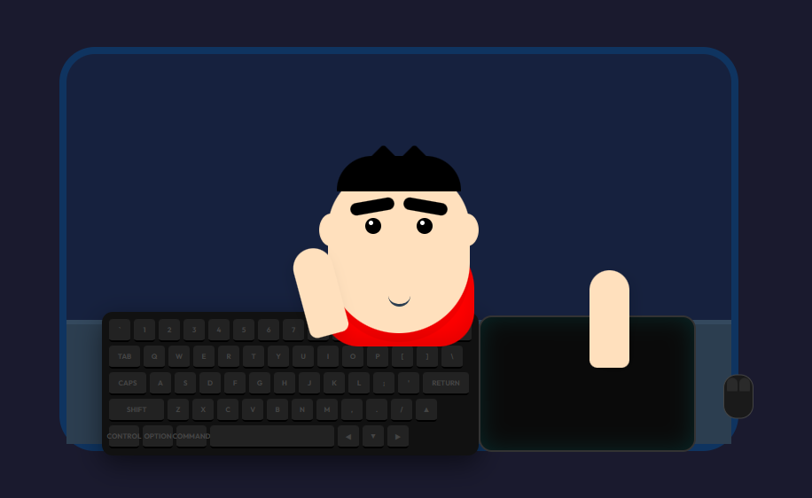

# Chibi Gamer Cursor 🎮✨

An interactive web-based animation featuring a **Chibi Character** (Shinchan Edition) that responds dynamically to your keyboard and mouse inputs in real-time.



## 🌟 Features

- **Real-time Synchronized Keyboard**: 
  - A detailed 75% mechanical keyboard layout.
  - Keys glow and animate when you press them on your physical keyboard.
  - Multi-key support with vibrant RGB-style effects.
- **Interactive Mouse System**:
  - Virtual mouse follows your physical cursor movements within the scene.
  - Left and Right click visual feedback with a glowing aura.
  - Custom right-click behavior (preventing default context menu for immersion).
- **Reactive Character Animation**:
  - **Right Hand**: Tracks the mouse movement precisely.
  - **Left Hand**: Automatically presses keys when you type.
  - **Facial Expressions**: Character's mouth opens when typing, creating a "typing talk" effect.
- **Premium Aesthetics**:
  - Dark-themed UI with "Outfit" typography.
  - Smooth CSS transitions and high-quality glows.
  - Shinchan-inspired character design with thick eyebrows and iconic red shirt.

## 🚀 Demo

Simply move your mouse around the scene and start typing any key to see the character react!

## 🛠️ Built With

- **HTML5**: Semantic structure for the game scene and keyboard layout.
- **CSS3**: Advanced positioning, Flexbox, custom variables, and glow animations.
- **Vanilla JavaScript**: High-performance event listeners for `keydown`, `keyup`, `mousemove`, and `mousedown`.

## 📂 Project Structure

```text
.
├── index.html    # Main structure & Keyboard layout
├── style.css     # Design system & Animations
└── script.js    # Interaction logic & Input handling
```

## ⚙️ Installation

1. **Clone the repository**:
   ```bash
   git clone https://github.com/alfiansetia/cartoon-interaction.git
   ```
2. **Open the project**:
   Launch `index.html` in any modern web browser (Chrome, Firefox, Edge).

## 🎮 How to Use

- **Move Mouse**: Watch the right hand and the virtual mouse move together.
- **Type**: Watch the left hand press keys and the mouth open.
- **Click**: Watch the mouse buttons light up.

---

Designed with ❤️ by [Alfian Setia](https://github.com/alfiansetia)
